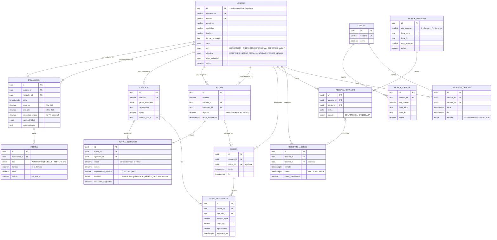

# Modelo de datos de GymTrack UNAL

Diagrama entidad-relación de la base de datos (GYMM-16). La fuente de verdad es
[`apps/api/prisma/schema.prisma`](../apps/api/prisma/schema.prisma); si cambias el esquema, actualiza este diagrama.

## Decisiones de diseño

- **Autenticación en Supabase Auth.** `usuario.id` es el mismo UUID de `auth.users`; la tabla `usuario` guarda solo el perfil. No hay llave foránea hacia `auth.users` porque ese esquema lo administra Supabase.
- **Evaluaciones inmutables (GYMM-13).** Cada evaluación es una fila nueva; las medidas variables (perímetros, pliegues, tests) van en `medida` para no tener una columna por cada una.
- **Franjas como plantilla semanal.** `franja_gimnasio` y `franja_cancha` describen el horario de cada día de la semana; la reserva del gimnasio guarda la `fecha` concreta.
- **`franja_cancha` se agregó** a la lista original de entidades para cumplir GYMM-20 (el personal de deportes define las franjas habilitadas).
- **Aforo en tiempo real (GYMM-33)** = registros de `registro_acceso` sin `salida`.
- **`serie_registrada` guarda el ejercicio** para el histórico (GYMM-31) y la precarga de la última carga (GYMM-26), aunque la rutina cambie después.

## Reglas que viven en la base de datos

Prisma no puede expresarlas en `schema.prisma`, así que están en SQL dentro de la primera migración:

| Regla | Historia | Cómo se garantiza |
| ----- | -------- | ----------------- |
| Dos reservas confirmadas de la cancha no se pueden solapar | GYMM-28 | Restricción de exclusión `reserva_cancha_sin_solapamiento` (btree_gist + `tstzrange`) |
| Solo una rutina vigente por usuario | GYMM-21 | Índice único parcial `rutina_una_vigente_por_usuario` |
| Un usuario no reserva dos veces la misma franja y fecha | GYMM-27 | Índice único parcial sobre reservas `CONFIRMADA` |
| Nadie tiene dos entradas abiertas al gimnasio | GYMM-32 | Índice único parcial sobre `registro_acceso` sin `salida` |
| Rangos razonables de peso, talla y % de grasa | GYMM-13 | Restricciones `CHECK` |
| Horas, días de la semana, cupos y series válidos | — | Restricciones `CHECK` |
| La API REST pública de Supabase no expone datos | — | RLS habilitado sin políticas en todas las tablas |

> El cupo máximo de cada franja del gimnasio se valida en el backend dentro de una transacción al crear la reserva.
